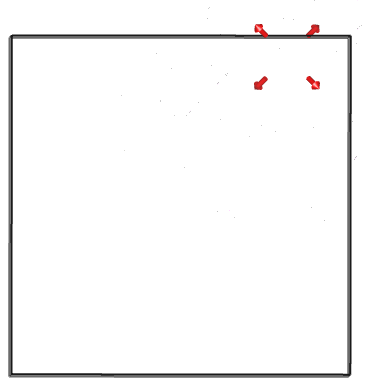
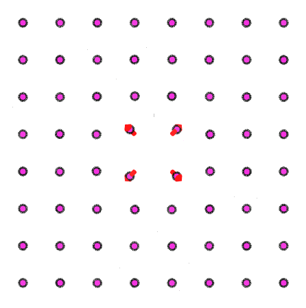

# vesta_vectors.py

A Python 3 script to visualise the extent of atomic displacement - useful for *ab-initio* defect calculations.
Uses the [Vesta](http://jp-minerals.org/vesta/en/) file format, which can be generated from a number of other structure data file formats using the Vesta software.
The only dependancy outside of the Python standard Library is NumPy, which is included in [standard scientific Python distributions](https://scipy.org/install.html).

**Input**

Two Vesta files: one for the initial structure (before relaxation), and one for the final structure (after relaxation).

**Output**

A Vesta file that contains vectors connecting the initial and final atomic positions.

### Command line options
```
-f  --filenames  
      description: name of initial and final Vesta files
      type: string  
      default: initial.vesta final.vesta
      
-r  --radius   
      description: vector radius (in angstrom)
      type: float
      default: 0.5
      
-c  --colour
      description: vector colour (in RGB)
      type: list(int)
      default: [255,0,0]
      
-x  --cutoff
      description: vectors with a modulus below this value will not be displayed (in angstrom)
      type: float
      default: 0.1
      
-sf --scale_factor
      description: scale all vector moduli by this amount
      type: float
      default: 1.0
      
-ca --centre_atom
      description: the output Vesta structure is centred around an atom in the initial structure, specified by this index position (indexing from one)
      type: int
      default: None
      
-ar --atoms_removed
      description: index position of atoms in initial structure which have been removed in final structure (indexing from one)
      type: list(int)
      default: []
      
-ai --atoms_inserted
      description: index position of atoms which have been inserted into the final structure (indexing from one)
      type: list(int)
      default: []      

```

### Example

Example input (`initial.vesta`, `final.vesta`) and output (`vectors.vesta`) data for a CdTe cell is contained in the `./data` folder.

``` python3 vesta_vectors.py -f ./data/initial.vesta ./data/final.vesta -ar 512 -ca 512 ```

This will generate the file `vectors.vesta`. The argument `-ar` is used because the final structure file has a Te vacancy defect; atom number 512 has been removed from the initial structure file. The argument `-ca` is used because we want the output structure to be centred around this defect.

When the output file `vectors.vesta` is opened in Vesta, you will see the following:



All the atoms and bonds are removed so that the vectors can be seen clearly. Any displacement vector with magnitude below 0.1 Angstrom is not displayed - this can be adjusted with the `-x / --cutoff` argument.
It is easy to make further adjustments to the output structure via Vesta - for example, I can turn off lighting effects, increase the size of the atoms, and adjust the z-axis boundary to give:



### Warnings!
 - This script has not been extensively tested - use at your own risk and check that the final vectors make sense.
 - The atoms must appear in the same order in the initial and final vesta files (it is possible to specify which atoms have been added or removed, if any)
 - It is assumed that there has been no change in cell volume or shape.

### Bugs

If vesta_vectors.py is not behaving as you expect, please [raise an issue](https://github.com/lucydot/vesta_vectors/issues).
